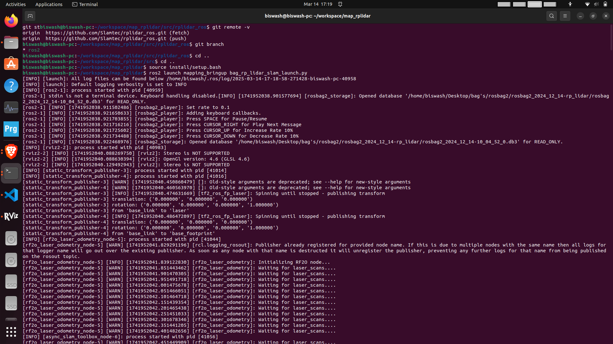
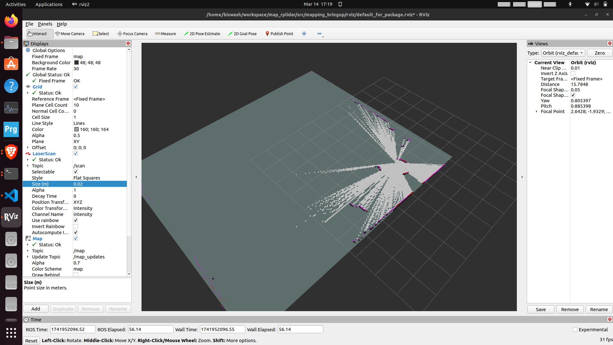

# Mapping_with_only_rplidar

## Overview
A ROS 2-based package for mapping using **RPLiDAR** and **RF2O laser odometry**. This repository integrates RPLiDAR for scanning and RF2O for odometry estimation, allowing autonomous mapping in an environment.

This is a package that make the 2D map of the environment with the help of RP lidar only. It only require RP Lidar to create the map. Instead you don't have the lidar, the bag file is attached herewith (a ROS bag file containing recorded LiDAR data is provided for testing). 

## 🛠 Features
- **LIDAR-based Mapping**: Uses RPLiDAR for 2D mapping.
- **Odometry Estimation**: Implements RF2O laser odometry.
- **ROS 2 Integration**: Works with ROS 2 Humble.
- **Customized Launch Files**: Optimized for RPLiDAR A1.

## 📂 Repository Structure
```bash
map_rplidar/
├── src/
│   ├── rplidar_ros/            # Forked package; publishes /scan in "laser" frame
│   ├── transforms/             # Static transformations for SLAM Toolbox
│   ├── rf2o_laser_odometry/    # Forked & modified; publishes /odom in "odom" frame  
│   ├── mapping_bringup/        # Launches all nodes at once  
```


## 🚀 Installation

### 1️⃣ Clone the Repository
```bash
git clone --recurse-submodules https://github.com/20-wash/map_rplidar.git
cd map_rplidar
```

### 2️⃣ Install the Dependencies
```bash
sudo apt update
sudo apt install -y ros-humble-slam-toolbox
```

### 3️⃣ Build the Package
```bash
colcon build --symlink-install
source install/setup.bash
```

### ▶️ Running the Lauch File 
#### With a Physical RPLiDAR
```bash
ros2 launch mapping_bringup rp_lidar_slam_launch.py 
```

### ▶️ Running the Lauch File 
#### Using a ROS Bag File
```bash
ros2 launch mapping_bringup bag_rp_lidar_slam_launch.py 
```
The bag file is played at 0.1x speed.

Launching the launch file



Visualization in rviz. The rviz config is saved inside (rviz) folder inside mapping_bringup package. 


 
A pre-recorded ROS bag file of RPLiDAR A1 is available for testing (Uploaded in google drive). Download it from:

https://drive.google.com/drive/folders/1ac5flexDKSGLY9R8HUW-PeE8mqBDgZBo?usp=sharing